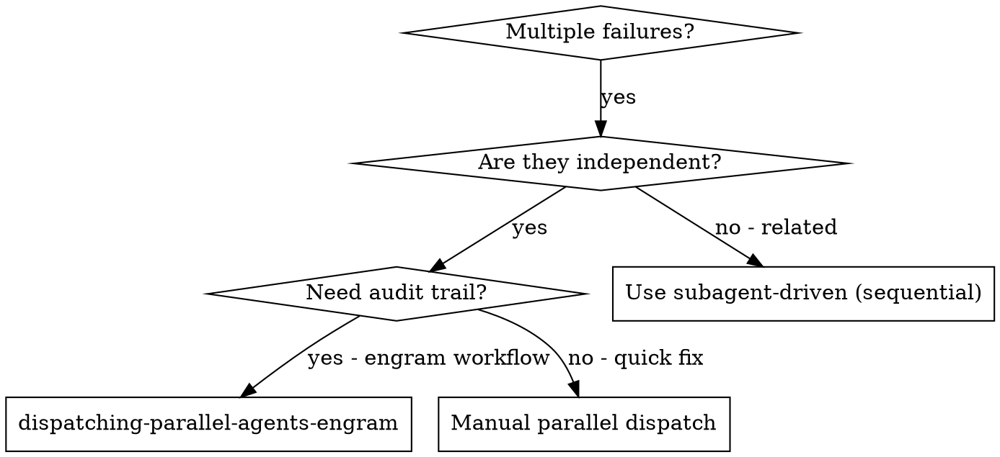

# Dispatching Parallel Agents (Engram-Integrated)

## Overview

When you have multiple unrelated failures or tasks, investigating them sequentially wastes time. Each investigation is independent and can happen in parallel using engram workflow engine.

**Core principle:** Dispatch one agent per independent problem domain via engram workflow. Let them work concurrently with full audit trail.

## Key Changes from Original

**Original:** Manual task dispatch, tracking in conversation
**Engram-integrated:** Creates engram workflow with parallel states, tracks agent assignment, stores results as reasoning entities.

## When to Use with Engram



**Use when:**
- 3+ test files failing with different root causes
- Multiple subsystems broken independently
- Need full audit trail in engram
- Each problem can be understood without context from others
- No shared state between investigations

**Don't use when:**
- Failures are related (fix one might fix others)
- Need to understand full system state
- Agents would interfere with each other
- Quick one-off fix without needing tracking

## The Engram Workflow Pattern

### Step 1: Identify Independent Domains

Group failures by what's broken, create engram reasoning:

```bash
# Create reasoning for domain analysis
engram reasoning create \
  --title "[Feature] Parallel Domain Analysis" \
  --task-id [PARENT_TASK_ID] \
  --content "## Problem Domains Identified\n\n### Domain 1: [Domain Name]\n- **Tests affected:** [test file 1], [test file 2]\n- **Root cause hypothesis:** [hypothesis]\n- **Scope:** [what agent should investigate]\n\n### Domain 2: [Domain Name]\n- **Tests affected:** [test file 3]\n- **Root cause hypothesis:** [hypothesis]\n- **Scope:** [what agent should investigate]\n\n### Domain 3: [Domain Name]\n- **Tests affected:** [test file 4], [test file 5]\n- **Root cause hypothesis:** [hypothesis]\n- **Scope:** [what agent should investigate]\n\n## Independence Justification\n1. [Why domain 1 doesn't affect domain 2]\n2. [Why domain 2 doesn't affect domain 3]\n3. [Why domain 1 doesn't affect domain 3]\n\n## Expected Timeline\n- Sequential: 3 x [time per investigation] = [total]\n- Parallel: [time per investigation] = [total]" \
  --confidence 0.8 \
  --tags "parallel,domain-analysis,[feature-tag]"
```

### Step 2: Create Engram Workflow

```bash
# Create workflow for parallel execution
WORKFLOW_ID=$(engram workflow create \
  --title "[Feature] Parallel Investigation Workflow" \
  --description "Dispatching [N] agents to investigate independent problem domains in parallel" \
  --json | jq -r '.id')

echo "Created workflow: $WORKFLOW_ID"
```

### Step 3: Add Workflow States

```bash
# Create states for each domain
engram workflow add-state \
  --name "planning" \
  --workflow-id $WORKFLOW_ID

engram workflow add-state \
  --name "domain-1-investigation" \
  --workflow-id $WORKFLOW_ID

engram workflow add-state \
  --name "domain-2-investigation" \
  --workflow-id $WORKFLOW_ID

engram workflow add-state \
  --name "domain-3-investigation" \
  --workflow-id $WORKFLOW_ID

engram workflow add-state \
  --name "integration" \
  --workflow-id $WORKFLOW_ID

engram workflow add-state \
  --name "complete" \
  --workflow-id $WORKFLOW_ID
```

### Step 4: Add Parallel Transitions

```bash
# Add parallel transitions (all investigation states run in parallel)
engram workflow add-transition \
  --from "planning" \
  --to "domain-1-investigation,domain-2-investigation,domain-3-investigation" \
  --workflow-id $WORKFLOW_ID

# All investigations must complete before integration
engram workflow add-transition \
  --from "domain-1-investigation,domain-2-investigation,domain-3-investigation" \
  --to "integration" \
  --condition "all_complete" \
  --workflow-id $WORKFLOW_ID

# Integration leads to complete
engram workflow add-transition \
  --from "integration" \
  --to "complete" \
  --workflow-id $WORKFLOW_ID
```

### Step 5: Dispatch Agents via Engram

For each domain, create subtask and assign agent:

```bash
# Domain 1 subtask
DOMAIN1_TASK=$(engram task create \
  --title "[Domain 1] Investigation: [Problem Description]" \
  --description "**Scope:** [Specific test files/components]\n\n**Goal:** Make failing tests pass\n\n**Constraints:**\n- Focus only on [domain 1]\n- Do NOT modify [domain 2] or [domain 3]\n- Return summary of root cause and changes\n\n**Failing tests:**\n- \`[test 1]\`: [error]\n- \`[test 2]\`: [error]" \
  --priority high \
  --agent agent-domain-1 \
  --json | jq -r '.id')

# Domain 2 subtask
DOMAIN2_TASK=$(engram task create \
  --title "[Domain 2] Investigation: [Problem Description]" \
  --description "**Scope:** [Specific test files/components]\n\n**Goal:** Make failing tests pass\n\n**Constraints:**\n- Focus only on [domain 2]\n- Do NOT modify [domain 1] or [domain 3]\n- Return summary of root cause and changes" \
  --priority high \
  --agent agent-domain-2 \
  --json | jq -r '.id')

# Domain 3 subtask
DOMAIN3_TASK=$(engram task create \
  --title "[Domain 3] Investigation: [Problem Description]" \
  --description "**Scope:** [Specific test files/components]\n\n**Goal:** Make failing tests pass\n\n**Constraints:**\n- Focus only on [domain 3]\n- Do NOT modify [domain 1] or [domain 2]\n- Return summary of root cause and changes" \
  --priority high \
  --agent agent-domain-3 \
  --json | jq -r '.id')

# Link to parent
engram relationship create \
  --source-id [PARENT_TASK_ID] \
  --target-id $DOMAIN1_TASK \
  --contains --agent default

engram relationship create \
  --source-id [PARENT_TASK_ID] \
  --target-id $DOMAIN2_TASK \
  --contains --agent default

engram relationship create \
  --source-id [PARENT_TASK_ID] \
  --target-id $DOMAIN3_TASK \
  --contains --agent default
```

### Step 6: Start Workflow

```bash
# Start the workflow
engram workflow start \
  --agent coordinator \
  --entity-id [PARENT_TASK_ID] \
  --entity-type task \
  $WORKFLOW_ID

# Get workflow instance ID
INSTANCE_ID=$(engram workflow list --json | jq -r '.[] | select(.workflow_id == "'$WORKFLOW_ID'") | .instance_id')
```

### Step 7: Track Parallel Progress

```bash
# Monitor workflow status
engram workflow status $INSTANCE_ID

# Expected output:
# planning → domain-1-investigation ✓, domain-2-investigation ✓, domain-3-investigation ✓
# Waiting for all to complete...
```

### Step 8: Review and Integrate

When agents complete, review results:

```bash
# Get results from each domain
engram reasoning list --task-id $DOMAIN1_TASK | grep -E "summary|fix|result"
engram reasoning list --task-id $DOMAIN2_TASK | grep -E "summary|fix|result"
engram reasoning list --task-id $DOMAIN3_TASK | grep -E "summary|fix|result"

# Create integration reasoning
engram reasoning create \
  --title "[Feature] Parallel Integration Summary" \
  --task-id [PARENT_TASK_ID] \
  --content "## Domain 1 Results\n**Agent:** agent-domain-1\n**Status:** ✅ COMPLETE\n**Root cause:** [description]\n**Fixes:** [files changed]\n\n## Domain 2 Results\n**Agent:** agent-domain-2\n**Status:** ✅ COMPLETE\n**Root cause:** [description]\n**Fixes:** [files changed]\n\n## Domain 3 Results\n**Agent:** agent-domain-3\n**Status:** ✅ COMPLETE\n**Root cause:** [description]\n**Fixes:** [files changed]\n\n## Conflict Check\n- Domain 1 files: [list]\n- Domain 2 files: [list]\n- Domain 3 files: [list]\n**Result:** ✅ No conflicts detected" \
  --confidence 0.9 \
  --tags "parallel,integration,[feature-tag]"

# Final verification
engram validate check

# Mark integration complete
engram workflow add-state-transition \
  --instance-id $INSTANCE_ID \
  --from "integration" \
  --to "complete"
```

## Engram Integration Summary

| Original Tracking | Engram Integration |
|-------------------|-------------------|
| Manual task list | engram task hierarchy with `--parent` |
| Agent assignment | `engram task --agent` |
| Progress tracking | `engram workflow status` |
| Parallel coordination | engram workflow with parallel states |
| Results documentation | engram reasoning entities |
| Integration summary | engram reasoning + validation |

## Querying Parallel Progress

```bash
# Get all domain tasks
engram task list --parent [PARENT_TASK_ID]

# Get workflow status
engram workflow status [INSTANCE_ID]

# Get results from specific domain
engram reasoning list --task-id [DOMAIN_TASK_ID]

# Get all parallel results
engram relationship connected --entity-id [PARENT_TASK_ID] --relationship-type contains

# Search for parallel execution results
engram reasoning list | grep "parallel.*result"
```

## Example Workflow

```bash
# Scenario: 6 test failures across 3 independent files

# Step 1: Create parent task
PARENT=$(engram task create \
  --title "Fix 6 Test Failures in Parallel" \
  --description "6 failures across 3 independent domains" \
  --priority high \
  --agent default \
  --json | jq -r '.id')

# Step 2: Analyze domains
engram reasoning create \
  --title "6 Test Failures: Domain Analysis" \
  --task-id $PARENT \
  --content "Domain 1: agent-tool-abort.test.ts (3 failures - timing)\nDomain 2: batch-completion-behavior.test.ts (2 failures - event structure)\nDomain 3: tool-approval-race-conditions.test.ts (1 failure - async wait)\nIndependent: Yes - separate subsystems" \
  --confidence 0.85 \
  --tags "parallel,domain-analysis,test-fixes"

# Step 3: Create workflow
WF=$(engram workflow create \
  --title "Test Fix Parallel Workflow" \
  --description "3 agents in parallel for 3 test files" \
  --json | jq -r '.id')

# Add states
for state in planning domain1 domain2 domain3 integration complete; do
  engram workflow add-state --name $state --workflow-id $WF
done

# Add transitions
engram workflow add-transition --from planning --to "domain1,domain2,domain3" --workflow-id $WF
engram workflow add-transition --from "domain1,domain2,domain3" --to integration --condition all_complete --workflow-id $WF
engram workflow add-transition --from integration --to complete --workflow-id $WF

# Step 4: Create subtasks
TASK1=$(engram task create \
  --title "Fix agent-tool-abort.test.ts (3 failures)" \
  --description "Timing issues in abort logic" \
  --parent $PARENT \
  --priority high \
  --agent agent-abort \
  --json | jq -r '.id')

TASK2=$(engram task create \
  --title "Fix batch-completion-behavior.test.ts (2 failures)" \
  --description "Event structure bugs" \
  --parent $PARENT \
  --priority high \
  --agent agent-batch \
  --json | jq -r '.id')

TASK3=$(engram task create \
  --title "Fix tool-approval-race-conditions.test.ts (1 failure)" \
  --description "Async wait issues" \
  --parent $PARENT \
  --priority high \
  --agent agent-approval \
  --json | jq -r '.id')

# Step 5: Start workflow
engram workflow start --agent coordinator --entity-id $PARENT --entity-type task $WF

# Step 6: Monitor
engram workflow status [instance_id]
# Output: domain1 ✓, domain2 ✓, domain3 ✓ → integration

# Step 7: Integration
engram reasoning create \
  --title "Test Fixes: Integration Summary" \
  --task-id $PARENT \
  --content "Agent 1 (abort): Fixed with event-based waiting\nAgent 2 (batch): Fixed threadId in event structure\nAgent 3 (approval): Added async wait for tool execution\nConflicts: None\nFull suite: ✅ All tests pass" \
  --confidence 1.0 \
  --tags "parallel,integration,complete"

engram validate check
```

## Key Benefits of Engram Integration

1. **Full Audit Trail:** Every dispatch, result, and integration step stored in engram
2. **Queryable:** `engram reasoning list | grep parallel` shows all parallel executions
3. **Reproducible:** Future agents can see what was done and why
4. **Parallel Safety:** Workflow engine ensures proper coordination
5. **Progress Visibility:** `engram workflow status` shows real-time progress
6. **Conflict Detection:** All changes documented, conflicts easily spotted

## Related Skills

This skill integrates with:
- `engram-delegate-to-agents` - Core delegation pattern for task breakdown
- `engram-subagent-driven-development` - Systematic multi-agent workflow
- `engram-use-memory` - Store parallel execution context
- `engram-audit-trail` - Track parallel agent work
- `engram-plan-feature` - Break features into parallelizable tasks
